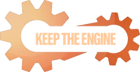
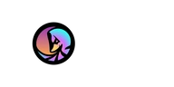

# GG Lab — taslak web sitesi

Akdeniz Üniversitesi Oyun ve Oyunlaştırma Topluluğu (Games & Gamification Lab) tanıtım sitesi.
Bağımlılık yok: düz HTML + CSS + JS.

Canlı: **https://nehirra.github.io/gglab-web/** (GitHub Pages, `main` dalına her push'ta yeniden yayınlanır)

## Çalıştırma

```bash
python3 -m http.server 4173
```
Sonra tarayıcıda `http://localhost:4173`.

## Dosyalar

- `index.html` — tek sayfa, tüm bölümler
- `css/style.css` — tema ve responsive kurallar
- `css/hud.css` — header + hero'nun HUD tarzı katmanı (sadece `index.html` yükler)
- `js/main.js` — menü, scroll reveal, galeri lightbox, form doğrulama
- `js/i18n.js` — TR/EN dil katmanı ve İngilizce sözlük
- Eski (HUD öncesi) tasarım repodan kaldırıldı; `git checkout v1-design` ile görülebilir
- `content/icerik.md` — topluluktan gelen ham metinler (vizyon/misyon, amaçlar, faaliyet alanları)
- `content/afis-referans.webp` — tanıtım afişi; **sitede kullanılmıyor**, yalnızca içerik kaynağı
- `content/gamejam-sponsorlar-*.jpg` — jam sponsor afişleri; yalnızca kaynak
- `assets/img/gamejam-logo.svg` — Game Jam Akdeniz logosu (topluluktan geldi)
- `assets/img/logo-yazili.png` — topluluk logosu (yazılı); `logo-yazisiz.png` — favicon
- `assets/img/logos/` — dışarıdan gelen kurum ve stüdyo logoları (ayrıntı aşağıda)
- `assets/img/event-*.webp` — etkinlik kartı görselleri

## Logo arşivi (`assets/img/logos/`)

Paydaş, sponsor ve kurum logoları burada tek klasörde durur. Ayrı klasörlere bölmedik:
bazı isimler hem topluluk paydaş listesinde hem jam destekçi listesinde geçiyor
(Keep The Engine, Heat Interactive, Solymos), ikiye bölmek aynı dosyayı çoğaltmayı gerektirirdi.

**Adlandırma kuralı:** uzantısız sade ad = **sitede kullanılan, koyu zemin için olan** sürüm.
Başka sürümler eki alır (`-acik-zemin`). `.webp` dosyaları banda göre küçültülmüş türevlerdir;
`.png`'ler tam çözünürlüklü kaynaktır, silinmemeli.

| Dosya | Kim | Nerede geçiyor | Durum |
|---|---|---|---|
| `keep-the-engine.png` + `.webp` | Keep The Engine | paydaş bandı + jam stüdyoları | **siteye bağlı** (bantlarda) |
| `keep-the-engine-acik-zemin.png` | aynı, açık zemin sürümü | — | yedek (basılı iş / açık temalı mecra) |
| `heat-interactive.png` + `.webp` | Heat Interactive | paydaş bandı + jam stüdyoları | **siteye bağlı** (ikisinde de) |
| `demonsoft.png` + `.webp` | DemonSoft | paydaş bandı | **siteye bağlı** — afişten çıkarıldı |
| `gamfed-turkiye.png` + `.webp` | GamFed Türkiye | paydaş bandı | **siteye bağlı** — afişten çıkarıldı |
| `vellichor-games.png` + `.webp` | Vellichor Games | paydaş bandı | **siteye bağlı** — afişten çıkarıldı |
| `reedon-games.png` + `.webp` | Reedon Games | paydaş bandı | **siteye bağlı** — afişten çıkarıldı |
| `solymos-games.png` + `.webp` | Solymos Games | paydaş bandı + jam stüdyoları | **siteye bağlı** — afişten çıkarıldı |
| `broken-lyre-entertainment.png` + `.webp` | Broken Lyre Entertainment | paydaş bandı | **siteye bağlı** — afişten çıkarıldı |
| `mages-market.png` + `.webp` | Mages Market | paydaş bandı | **siteye bağlı** — afişten çıkarıldı |
| `rogue-duck.png` + `.webp` | Rogue Duck | yalnızca jam stüdyoları | **siteye bağlı** |
| `akdeniz-universitesi.png` + `.webp` | Akdeniz Üniversitesi | jam düzenleyenleri | **siteye bağlı** — ama çözünürlük zayıf, aşağıya bak |

`akdeniz-universitesi.png` yalnızca 300×300 ve 2-bit renk paletiyle kaydedilmiş; armanın kendi
lacivert diski (`#13294c`) sitenin zeminine (`#0c1631`) çok yakın olduğu için koyu zeminde
disk kayboluyor, geriye turuncu "A" ve beyaz yazı kalıyor. Şu an jam bölümünde 22px olarak duruyor: turuncu "A" seçiliyor,
çevresindeki yazı seçilmiyor. Üniversiteden yüksek çözünürlüklü (tercihen beyaz/tek renk)
sürüm gelirse yalnızca `.png`'yi değiştirip `.webp`'yi yeniden üretmek yeterli.

## Bölüm düzeni

`#gamejam` bölümü topluluğun amiral gemisi etkinliğini tek başına anlatır; jam'in
kendi sponsor listesi **yalnızca orada** durur ve etkinlik adı + yılıyla etiketlidir.
Sayfa altındaki `#paydaslar` bandı ise topluluğun kendi paydaşlarıdır — iki liste
bilinçli olarak ayrıdır, birleştirilmemelidir.

`#etkinlikler` bölümü takvim değil, **etkinlik türü tanıtımıdır**; tarih iddiası içermez.
Tarihi kesinleşen etkinlikler için ayrı bir takvim bloğu eklenebilir.

## Dikey ölçek

Hero `100svh` yüksekliğinde ve içeriği ekran yüksekliğine göre ölçekleniyor.
Diğer bölümler için `css/style.css` sonundaki `@media (max-height:820px)` ve
`(max-height:640px)` blokları boşlukları, yazı boyutlarını ve kart ölçülerini küçültür;
kısa ekranlarda (ölçeklenmiş dizüstü görünümleri) bölümler yaklaşık bir ekrana sığar.

Etkinlik kartları kısa ve geniş ekranlarda yatay düzene geçer (görsel solda dar şerit),
1180px üstü ve uzun ekranlarda dört kart tek sıraya dizilir.

## Kayan paydaş bandı (marquee)

Hero'nun altındaki şerit ve Paydaşlar bölümü sonsuz döngüde kayar.
Her bant **iki özdeş şeritten** oluşur (`.marquee-track`); ikincisi `aria-hidden="true"`
olduğu için ekran okuyucu listeyi bir kez okur. Şerit `translateX(-100%)` ile kayar,
ilki çıkarken ikincisi yerine geçer, böylece dikiş görünmez.

- Hız: `.marquee-track` üzerindeki `animation-duration` (hero 30s, bölüm 46s)
- Öğeler arası boşluk: `--gap` değişkeni (şeridin sonundaki `padding-right` da bunu kullanır,
  yoksa iki şeridin birleştiği yerde isimler birbirine yapışır)
- Üzerine gelince durur (`:hover`, `:focus-within`)
- `prefers-reduced-motion` açıksa animasyon kapanır, şerit elle kaydırılabilir olur

Logosu gelen paydaş, isminin yerine değil **isminin yanına** logo alır:

```html
<li class="partner has-logo">
  
  <span>Keep The Engine</span>
</li>
```

Hero şeridinde `class="partner"` yoktur, yalnızca `has-logo` kullanılır. `alt` bilerek boştur —
isim zaten `<span>` içinde metin olarak duruyor, ekran okuyucu iki kez okumasın diye.
`loading="lazy"` bilerek **yok**: bandın ikinci (kopya) şeridi ekranın sağında durduğu için
tarayıcı onu geç yüklüyor ve döngü ilk kez dönerken logo bir an boş kalıyordu.
İsmin kalması bir tercih değil zorunluluk: bu logolardaki kelime işaretleri bant yüksekliğinde
(hero ~22px, bölüm ~30px) okunmuyor, tek başına logo ismi görünmez yapıyor.
Logo dosyası eklerken aynı `<li>` bandın **her iki şeridinde de** değişmeli
(hero 2, Paydaşlar bölümü 4 kopya — toplam 6 yer).

Game Jam bölümündeki destekçi etiketleri de aynı mantıkla çalışır, tek farkı `class="partner"`
yerine düz `has-logo` ve logonun 22px olması:

```html
<li class="has-logo">
  
  <span>Rogue Duck</span>
</li>
```

`.logo-mark` üç bağlamda da ortak sınıftır; yüksekliği bağlamı saran kural belirler
(`.partner .logo-mark` 30px, `.chips .logo-mark` 22px, hero şeridinde `clamp(18px,2.3vh,24px)`).

## Dil (TR / EN)

Varsayılan dil **İngilizce**. Header'daki tek düğmede yalnızca yürürlükteki dil yazar
(`EN`); tıklayınca diğer dile geçer. Tercih `localStorage` içinde saklanır.
Düğmenin `aria-label`'ı hangi dile geçileceğini söyler, böylece ekran okuyucuda anlamlı kalır.

Türkçe metinler doğrudan `index.html` içinde durur; İngilizce karşılıkları `js/i18n.js`
içindeki `EN` sözlüğündedir. Yeni metin eklerken:

1. HTML'de elemana `data-i18n="bolum.anahtar"` ekle (Türkçesini içine yaz)
2. `js/i18n.js` içindeki `EN` sözlüğüne aynı anahtarla İngilizcesini ekle

Öznitelikler için: `data-i18n-ph` (placeholder), `data-i18n-aria` (aria-label),
`data-i18n-alt` (alt), `data-i18n-cap` (galeri başlığı), `data-i18n-meta` (meta content).
Sözlükte karşılığı bulunmayan anahtar Türkçesine düşer, sayfa boş kalmaz.

**Not:** JavaScript kapalıyken sayfa Türkçe görünür (HTML'in kendi metni Türkçe).

## İçerik kaynağı

Metinler **GGLAB Tüzük (revize)** belgesinden ve tanıtım afişinden alındı.
Vizyon/misyon paragrafları tüzüğün 1. ve 8. maddelerinden yola çıkarak yazıldı — onaylanması gerekiyor.

## Eksikler (sitede `todo` sınıfıyla işaretli)

- [ ] Sosyal medya linkleri (Instagram, Discord, X, YouTube, LinkedIn, itch.io)
- [ ] İletişim e-posta adresi
- [ ] Etkinlik tarihleri, yerleri ve geçmiş etkinlikler
- [ ] Etkinlik ve galeri fotoğrafları (`assets/img/` içine at, `index.html`'de yolları değiştir)
- [x] Paydaş logoları — 9 paydaşın tamamı bantlara eklendi; 7 tanesi afiş kaynağından çıkarıldı
- [ ] Jam destekçi logoları — 16 destekçiden 4'ü geldi; Akdeniz Üniversitesi arması düşük çözünürlüklü
- [ ] İletişim formunun bir servise bağlanması (Formspree, Google Form vb.)
- [ ] Vizyon/misyon metinlerinin yönetim kurulu onayı
- [ ] `content/icerik.md` içindeki amaç metinlerinin ve 13 maddelik faaliyet listesinin siteye işlenmesi
- [ ] Yer tutucu SVG görsellerindeki yazılar Türkçe sabit — gerçek görseller gelince sorun kalmayacak

## Renkler

`css/style.css` içindeki `:root` bloğunda:
lacivert `#0c1631`, turuncu `#f47c20`, mavi `#4d7cff`, mor `#8b5cf6`.
