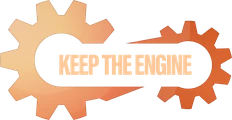
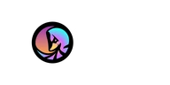

# GG Lab — taslak web sitesi

Akdeniz Üniversitesi Oyun ve Oyunlaştırma Topluluğu (Games & Gamification Lab) tanıtım sitesi.
Bağımlılık yok: düz HTML + CSS + JS.

Canlı: **https://nehirra.github.io/gglab-web/** (GitHub Pages, `main` dalına her push'ta yeniden yayınlanır)

## Çalıştırma

```bash
python3 -m http.server 4173
```
Sonra tarayıcıda `http://localhost:4173`. (`main.js` bir ES modülü olduğu için sayfa
`file://` ile doğrudan açılırsa çalışmaz; yerel sunucu gerekli.)

## Denetim (lint)

Kurulum gerekmez, `npx` araçları geçici olarak indirir:

```bash
npx html-validate@9 index.html 404.html
npx stylelint@16 "css/*.css"
```

- `.editorconfig` — UTF-8, LF, 2 boşluk girinti
- `.htmlvalidate.json` — önerilen kurallar; satır içi stil ve `<br>` yazımı serbest
- `.stylelintrc.json` — yalnızca hata yakalayan kurallar (bilinmeyen özellik/birim,
  geçersiz renk, çakışan kısaltma…); biçim kuralı yok, tek satırlık kompakt CSS yazımı korunuyor.
  `no-duplicate-selectors` bilerek kapalı: `style.css` katmanlı yazıldı (ör. "mor vurgular"
  bloğu önceki kuralların rengini ezer), aynı seçicinin tekrar geçmesi tasarım gereği.

## Neden build adımı yok

Site tek sayfa ve küçük; bağımlılık, `node_modules` ya da derleme olmadan GitHub Pages'e
doğrudan yayınlanıyor, topluluktan herkes dosyayı açıp düzenleyebiliyor. Tekrarlanan
işaretlemenin en büyüğü (partner bantları) JS ile tek listeden üretiliyor.
Sayfa sayısı artarsa ya da bölümler ayrı dosyalara bölünmek istenirse Eleventy gibi
bir statik site üreticisine geçmek mantıklı olur.

## Dosyalar

- `index.html` — tek sayfa, tüm bölümler
- `404.html` — GitHub Pages'in eksik adreslerde gösterdiği sayfa; site CSS'ini kullanır,
  `<base>`'i adrese göre kendisi kurar (`/gglab-web/` ya da özel alan adında `/`)
- `css/style.css` — tema ve responsive kurallar
- `css/hud.css` — header + hero'nun HUD tarzı katmanı (`index.html` ve `404.html` yükler)
- `js/main.js` — partner bantları, menü, scroll reveal, galeri lightbox, yaklaşan etkinlikler, form doğrulama (ES modülü)
- `js/i18n.js` — TR/EN dil katmanı ve İngilizce sözlük (şu an yüklenmiyor, bkz. Dil)
- Eski (HUD öncesi) tasarım repodan kaldırıldı; `git checkout v1-design` ile görülebilir
- `content/icerik.md` — topluluktan gelen ham metinler (vizyon/misyon, amaçlar, faaliyet alanları)
- `content/etkinlikler.csv` — Yaklaşan etkinlikler listesi (bkz. Yaklaşan etkinlikler)
- `content/afis-referans.webp` — tanıtım afişi; **sitede kullanılmıyor**, yalnızca içerik kaynağı
- `content/gamejam-sponsorlar-*.jpg` — jam sponsor afişleri; yalnızca kaynak
- `assets/img/gamejam-logo.svg` — Game Jam Akdeniz logosu (topluluktan geldi)
- `assets/img/logo-yazili.png` — topluluk logosu (yazılı); `logo-yazisiz.png` — favicon
- `assets/img/logos/` — dışarıdan gelen kurum ve stüdyo logoları (ayrıntı aşağıda)
- `assets/img/event-*.webp` — etkinlik kartı görselleri

## Logo arşivi (`assets/img/logos/`)

Paydaş, sponsor ve kurum logoları burada tek klasörde durur. Ayrı klasörlere bölmedik:
bazı isimler hem topluluk paydaş listesinde hem jam destekçi listesinde geçiyor
(Keep The Engine, Heat Interactive, Solymos), ikiye bölmek aynı dosyayı çoğaltmayı gerektirirdi.

**Adlandırma kuralı:** uzantısız sade ad = **sitede kullanılan, koyu zemin için olan** sürüm.
Başka sürümler eki alır (`-acik-zemin`). `.webp` dosyaları banda göre küçültülmüş türevlerdir;
`.png`'ler tam çözünürlüklü kaynaktır, silinmemeli.

| Dosya | Kim | Nerede geçiyor | Durum |
|---|---|---|---|
| `keep-the-engine.png` + `.webp` | Keep The Engine | paydaş bandı + jam stüdyoları | **siteye bağlı** (bantlarda) |
| `keep-the-engine-acik-zemin.png` | aynı, açık zemin sürümü | — | yedek (basılı iş / açık temalı mecra) |
| `heat-interactive.png` + `.webp` | Heat Interactive | paydaş bandı + jam stüdyoları | **siteye bağlı** (ikisinde de) |
| `demonsoft.png` + `.webp` | DemonSoft | paydaş bandı | **siteye bağlı** — afişten çıkarıldı (ilk kesim sağdan kırpıktı, yeniden çıkarıldı) |
| `gamfed-turkiye.png` + `.webp` | GamFed Türkiye | paydaş bandı | **siteye bağlı** — afişten çıkarıldı (ilk kesim kırpıktı, yeniden çıkarıldı) |
| `vellichor-games.png` + `.webp` | Vellichor Games | paydaş bandı | **siteye bağlı** — afişten çıkarıldı (ilk kesim kırpıktı, yeniden çıkarıldı) |
| `reedon-games.png` + `.webp` | Reedon Games | paydaş bandı | **siteye bağlı** — afişten çıkarıldı |
| `solymos-games.png` + `.webp` | Solymos Games | paydaş bandı + jam stüdyoları | **siteye bağlı** — afişten çıkarıldı (ilk kesim kırpıktı, yeniden çıkarıldı) |
| `broken-lyre-entertainment.png` + `.webp` | Broken Lyre Entertainment | paydaş bandı | **siteye bağlı** — afişten çıkarıldı (ilk kesim kırpıktı, yeniden çıkarıldı) |
| `mages-market.png` + `.webp` | Mages Market | paydaş bandı | **siteye bağlı** — afişten çıkarıldı (ilk kesimde komşu logodan parça vardı, yeniden çıkarıldı; koyu "MARKET" yazısı koyu zeminde görünsün diye açık griye çevrildi) |
| `rogue-duck.png` + `.webp` | Rogue Duck | yalnızca jam stüdyoları | **siteye bağlı** |
| `akdeniz-universitesi.png` + `.webp` | Akdeniz Üniversitesi | jam düzenleyenleri | **siteye bağlı** — ama çözünürlük zayıf, aşağıya bak |

`akdeniz-universitesi.png` yalnızca 300×300 ve 2-bit renk paletiyle kaydedilmiş; armanın kendi
lacivert diski (`#13294c`) sitenin zeminine (`#0c1631`) çok yakın olduğu için koyu zeminde
disk kayboluyor, geriye turuncu "A" ve beyaz yazı kalıyor. Şu an jam bölümünde 22px olarak duruyor: turuncu "A" seçiliyor,
çevresindeki yazı seçilmiyor. Üniversiteden yüksek çözünürlüklü (tercihen beyaz/tek renk)
sürüm gelirse yalnızca `.png`'yi değiştirip `.webp`'yi yeniden üretmek yeterli.

## Performans

İlk açılışta yalnızca ekranın üstünde görünen şeyler iner (~245 KB: fontlar, CSS, JS,
logo ve partner bandı). Korunması gerekenler:

- **Fontlar:** `assets/fonts/*-tr.woff2` yalnızca Latin-1 dışındaki Türkçe harfleri
  (Ğ ğ İ Ş ş) içerir; ı ve Ç Ö Ü temel `*-latin.woff2` dosyasında. Google'ın tam latin-ext
  dosyaları ~120 KB'tı, bunlar toplam ~7 KB. Başka bir harf gerekirse (ör. Ā, Ł) fonttools ile
  yeniden üret ve `style.css`'teki `unicode-range`'i genişlet:
  `pyftsubset <google-latin-ext>.woff2 --unicodes="U+011E-011F,U+0130,U+015E-015F" --flavor=woff2 --layout-features='*' --output-file=inter-tr.woff2`
- **Animasyonlar:** sürekli dönen animasyonlar yalnızca `transform`/`opacity` değiştirmeli
  (ekran kartında çalışır). `background-position`, `left`, `width` gibi özellikleri sonsuz
  döngüde canlandırmak her karede yeniden boyama demek; ızgaralar bu yüzden sabit.
- **Görseller:** sayfa altındakiler `loading="lazy"`. Üyelik arka planı CSS'te olduğu için
  `main.js` onu bölüme bir ekran kala `.bg-in` sınıfıyla açar. Etkinlik görselleri 800px,
  galerinin büyük görselleri en fazla 1600px yükseklikte; yeni görsel eklerken bu ölçülere indir.
- **SVG:** `gamejam-logo.svg` svgo ile küçültüldü (`npx svgo --multipass`).

## Bölüm düzeni

`#gamejam` bölümü topluluğun amiral gemisi etkinliğini tek başına anlatır; jam'in
kendi sponsor listesi **yalnızca orada** durur ve etkinlik adı + yılıyla etiketlidir.
Hero'daki partner bandı ise topluluğun kendi paydaşlarıdır — iki liste bilinçli olarak
ayrıdır, birleştirilmemelidir. Partnerler yalnızca hero'da gösterilir; sayfanın altında
ayrı bir Partnerler bölümü yoktur.

`#etkinlikler` bölümü takvim değil, **etkinlik türü tanıtımıdır**; tarih iddiası içermez.
Tarihi kesinleşen etkinlikler `#yaklasan` bölümünde listelenir (bkz. Yaklaşan etkinlikler).

`#gamejam` bir oyunun "bölüm seçme" ekranı gibi kurulu: solda kutu kapağı (`jam-06` fotoğrafı +
logo), sağda bilgiler ve istatistikler, altında galeriden 4 ekran
görüntüsü (tıklayınca galerinin lightbox'ı açılır), kilitli "Level 02" kartı ve destekçi jeneriği.
2027 tarihi belli olunca kilitli karttaki metni güncelle ve `content/etkinlikler.csv` satırını tam tarihe çevir.

## Dikey ölçek

Hero `100svh` yüksekliğinde ve içeriği ekran yüksekliğine göre ölçekleniyor.
Diğer bölümler için `css/style.css` sonundaki `@media (max-height:820px)` ve
`(max-height:640px)` blokları boşlukları, yazı boyutlarını ve kart ölçülerini küçültür;
kısa ekranlarda (ölçeklenmiş dizüstü görünümleri) bölümler yaklaşık bir ekrana sığar.

Etkinlik kartları kısa ve geniş ekranlarda yatay düzene geçer (görsel solda dar şerit),
1180px üstü ve uzun ekranlarda dört kart tek sıraya dizilir.

## Kayan partner bandı (marquee)

Hero'nun altındaki partner şeridi sonsuz döngüde kayar. Liste tek yerde durur:
hero içindeki `.marquee-track` listesi. `data-marquee` taşıyan banda `js/main.js`
`aria-hidden="true"` ikinci bir kopya şerit ekler; ekran okuyucu listeyi bir kez okur.
Liste bandın genişliğinden kısa kalırsa (geniş/alçak ekranda logolar küçülünce) `main.js`
öğeleri gizli kopyalarla bandı dolduracak kadar çoğaltır; yoksa döngünün dikişinde büyük
bir boşluk kalır. Pencere boyutu değişince yeniden kontrol edilir.
Şerit `translateX(-100%)` ile kayar, ilki çıkarken kopyası yerine geçer, dikiş görünmez.

- Hız: `js/main.js` içindeki `MARQUEE_SPEED` (px/sn, şu an 20). Tur süresi şerit genişliğinden
  hesaplanır, böylece bant her ekran genişliğinde aynı hızda akar
- Öğeler arası boşluk: `--gap` değişkeni (şeridin sonundaki `padding-right` da bunu kullanır,
  yoksa iki şeridin birleştiği yerde isimler birbirine yapışır)
- Üzerine gelince durur (`:hover`, `:focus-within`)
- `prefers-reduced-motion` açıksa animasyon kapanır, şerit elle kaydırılabilir olur

Şeritte yalnızca logo durur; partnerin adı `alt` metnindedir:

```html
<li class="has-logo">
  
</li>
```

`loading="lazy"` bilerek **yok**: bandın kopya şeridi ekranın sağında durduğu
için tarayıcı onu geç yüklüyor ve döngü ilk kez dönerken logo bir an boş kalıyordu.
Logolar isimsiz okunabilsin diye bant yüksekliği büyütüldü (masaüstünde 26–36px, telefonda 26px).
Aynı yükseklikte dik/kare logolar enlilerin yanında küçük kaldığı için `<li>`'ye oranına göre
bir sınıf verilir: `logo-tall` (en/boy ~1.1 ve altı, ×1.4), `logo-square` (~1.5, ×1.2),
`logo-wide` (~2.8 ve üstü, ×0.85); oranı ~2 civarı olanlar sınıfsız kalır. Yeni logo eklerken
`width`/`height` oranına bakıp uygun sınıfı ver.

Game Jam bölümündeki destekçi etiketleri de aynı mantıkla çalışır, logo 22px'tir:

```html
<li class="has-logo">
  
  <span>Rogue Duck</span>
</li>
```

`.logo-mark` üç bağlamda da ortak sınıftır; yüksekliği bağlamı saran kural belirler
(`.chips .logo-mark` 22px, hero şeridinde `clamp(26px,3.6vh,36px)`).

## Yaklaşan etkinlikler

`#yaklasan` bölümündeki liste bir CSV dosyasından okunur (`<section id="yaklasan" data-sheet="…">`).
Şimdilik bu dosya repodaki **`content/etkinlikler.csv`**; ileride bir Google E-Tablosuna geçilebilir.

**Etkinlik eklemek / düzenlemek (şimdiki yol)**
1. GitHub'da `content/etkinlikler.csv` dosyasını aç, kalem simgesiyle düzenle.
2. Her etkinlik bir satır; sütun sırasını koru. Boş bırakılan alan sitede görünmez.
3. "Commit changes" de; site 1–2 dakika içinde güncellenir.

```csv
baslik,tarih,saat,yer,tur,aciklama,link
Kutu Oyunu Günü,10.10.2026,18:00,Kampüs kafeterya,Kutu oyunu,Kısa açıklama,
Unity atölyesi,2026-11-05,18:00,"Mühendislik Fakültesi, Z-12",Atölye,Laptopunu getir.,https://forms.gle/…
Game Jam,Ocak 2027,,,Game Jam,Kesin tarih yakında.,
```

| Sütun | Zorunlu | Not |
| --- | --- | --- |
| `baslik` | evet | Etkinliğin adı |
| `tarih` | evet | `10.10.2026` ya da `2026-10-10`; günü belli değilse yalnızca ay: `Ocak 2027`, `01.2027`, `2027-01` |
| `saat` | hayır | `18:00` |
| `yer` | hayır | İçinde virgül varsa çift tırnak içine al: `"Mühendislik Fakültesi, Z-12"` |
| `tur` | hayır | Atölye, Söyleşi, Kutu oyunu, Game Jam… (küçük etiket olarak görünür) |
| `aciklama` | hayır | Bir iki cümle; virgül varsa çift tırnak |
| `link` | hayır | Kayıt formu / Discord etkinliği; yalnızca `https://…` |
| `gorsel` | hayır | Yerel görsel yolu (`assets/img/…`) veya HTTPS görsel adresi |
| `oncelik` | hayır | `1`: büyük buluşma, `2`: özel etkinlik, `3`: düzenli buluşma. Boş veya geçersiz değerler `3` sayılır. |

- Tarihi geçen satırlar sitede kendiliğinden gizlenir; silmek gerekmez. Yalnızca ayı yazılan etkinlik
  o ay bitene kadar "Kesin tarih yakında" etiketiyle görünür.
- En fazla 6 etkinlik gösterilir. En yakın Level 1 etkinlik ana afişte, kalanlar tarihe göre listelenir. Ana afiş altılı sınırına dahildir; daha ileride olsa da korunur. Birden fazla Level 1 varsa diğerleri takvimde güçlü vurguyla görünür.
- Level 2 orta boy kart, Level 3 kompakt satır olarak gösterilir. Level 1 yoksa takvim iki sütundur; mobilde tek sütuna iner.
- "Sıradaki" etiketi, öncelikten bağımsız olarak kesin günü belli en yakın etkinlikte kalır. Hiçbirinin günü belli değilse en yakın ayda görünür. Yalnızca günü belli etkinliklerde kaç gün kaldığı yazılır.
- Liste boşsa ya da dosya okunamazsa bölüm "Takvim şu an boş / yüklenemedi" mesajı ve Discord düğmesi gösterir.
- Metinler sayfaya düz metin olarak yazılır (HTML çalışmaz).

**İleride Google E-Tablolar'a geçmek** (GitHub kullanmayan ekip üyeleri de düzenleyebilsin diye)
1. Yeni bir Google E-Tablosu aç, `content/etkinlikler.csv` dosyasını içe aktar (Dosya > İçe aktar).
2. Dosya > Paylaş > **Web'de yayınla** > ilgili sayfa + **Virgülle ayrılmış değerler (.csv)** > Yayınla.
3. Verilen adresi (`https://docs.google.com/spreadsheets/d/e/…/pub?…&output=csv`) `data-sheet` içine yaz.
   Sütunlar aynı kalır; Google yayınlanan CSV'yi birkaç dakika önbellekte tuttuğu için değişiklik ~5 dk'da yansır.

## Bülten

İletişim bölümündeki bülten kutusu (`#newsletterForm`) şu an **e-posta toplamaz**: formda
`action` yokken geçerli bir adres girilince "yakında" notu gösterir. Servis hazır olunca
(alan adı + Formspree, Buttondown, kendi sunucumuz vb.) forma `action="…"` ve `method="post"`
eklemek yeterli; `main.js` form verisini `fetch` ile o adrese POST eder (`Accept: application/json`)
ve yanıta göre teşekkür ya da hata mesajı gösterir. Form tek alan gönderir: `email`.

## Hero mini oyunu

Hero'da düşen 10 tuş (telefonda 8; `.xb`, `data-k="a|b|x|y"`) yakalanabilir: tıklamak/dokunmak, klavyede
A/B/X/Y'ye ya da bağlı bir kumandada (Gamepad API, standart düzen) aynı tuşlara basmak ekranda
görünen eşleşen tuşu patlatır ve +10 puan yazar. Skor (`#xbScore`) ilk puanda görünür,
kaydedilmez. Form alanına yazarken klavye tetiklemez. Hero içerik kapsayıcıları
`pointer-events:none`, yalnızca metin/logo/partner şeridi tıklamayı yakalar — tuşlar boşluklarda
tıklanabilir kalsın diye.

## Dil (TR / EN)

Site şu an **yalnızca Türkçe**. İngilizce altyapı hazır ama kapalı: `js/i18n.js`
`index.html`'de yüklenmiyor ve header'daki dil düğmesi (`#langToggle`) `hidden`.
`main.js` çeviri katmanı olmadan da çalışır (menü ve form mesajları için Türkçe yedeği var).

**İngilizceyi açmak için:**
1. `index.html` sonundaki yorum satırına alınmış `<script src="js/i18n.js">` satırını geri koy
2. `#langToggle` düğmesinden `hidden` özniteliğini kaldır
3. `js/i18n.js` içinde `EN_ENABLED = true` yap

Açıldığında varsayılan dil İngilizcedir; tercih `localStorage` içinde saklanır.
Düğmede yalnızca yürürlükteki dil yazar, `aria-label`'ı hangi dile geçileceğini söyler.

Türkçe metinler doğrudan `index.html` içinde durur; İngilizce karşılıkları `js/i18n.js`
içindeki `EN` sözlüğündedir. Yeni metin eklerken (İngilizce kapalıyken de yapılmalı):

1. HTML'de elemana `data-i18n="bolum.anahtar"` ekle (Türkçesini içine yaz)
2. `js/i18n.js` içindeki `EN` sözlüğüne aynı anahtarla İngilizcesini ekle

Öznitelikler için: `data-i18n-ph` (placeholder), `data-i18n-aria` (aria-label),
`data-i18n-alt` (alt), `data-i18n-cap` (galeri başlığı), `data-i18n-meta` (meta content).
Sözlükte karşılığı bulunmayan anahtar Türkçesine düşer, sayfa boş kalmaz.

## İçerik kaynağı

Metinler **GGLAB Tüzük (revize)** belgesinden ve tanıtım afişinden alındı.
Vizyon/misyon paragrafları tüzüğün 1. ve 8. maddelerinden yola çıkarak yazıldı — onaylanması gerekiyor.

## Eksikler (sitede `todo` sınıfıyla işaretli)

- [ ] Sosyal medya linkleri (Instagram, Discord, X, YouTube, LinkedIn, itch.io)
- [x] İletişim e-posta adresi — gglabakdeniz@gmail.com
- [ ] Etkinlik tarihleri, yerleri ve geçmiş etkinlikler
- [ ] Etkinlik ve galeri fotoğrafları (`assets/img/` içine at, `index.html`'de yolları değiştir)
- [x] Paydaş logoları — 9 paydaşın tamamı bantlara eklendi; 7 tanesi afiş kaynağından çıkarıldı
- [ ] Jam destekçi logoları — 16 destekçiden 4'ü geldi; Akdeniz Üniversitesi arması düşük çözünürlüklü
- [ ] İletişim formunun bir servise bağlanması (Formspree, Google Form vb.)
- [ ] Bülten kutusunun bir servise bağlanması (bkz. Bülten)
- [ ] Alan adı bağlanınca `og:url` / `og:image` adreslerinin güncellenmesi
- [ ] Vizyon/misyon metinlerinin yönetim kurulu onayı
- [ ] `content/icerik.md` içindeki amaç metinlerinin ve 13 maddelik faaliyet listesinin siteye işlenmesi
- [ ] Yer tutucu SVG görsellerindeki yazılar Türkçe sabit — gerçek görseller gelince sorun kalmayacak

## Renkler

`css/style.css` içindeki `:root` bloğunda:
lacivert `#10214d`, turuncu `#f47c20`, mavi `#4d7cff`, mor `#8b5cf6`.
